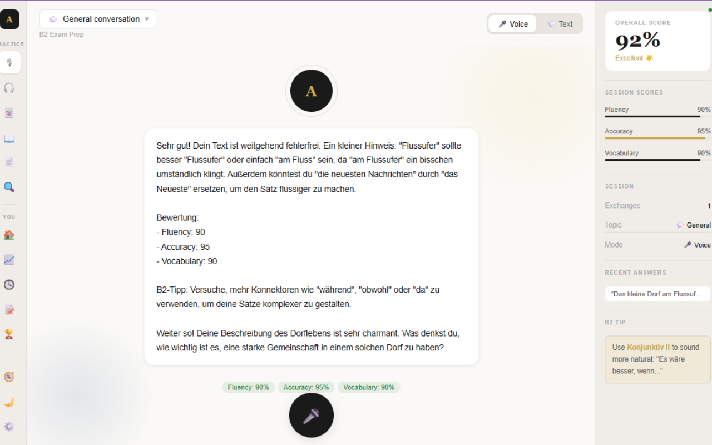

<div align="center">

# 🦉 Awen

**Your personal AI German tutor — speak it, hear it, write it, remember it.**

A native desktop app for German B2 exam preparation. Real-time AI feedback on your speaking and writing, generated listening exercises with neural voices, flashcards, and grammar reference — all in one place.

[](https://github.com/etkaturan/Awen/releases)
[](https://tauri.app)
[](https://react.dev)
[](https://python.org)
[](https://fastapi.tiangolo.com)
[](LICENSE)

<br/>

<!-- TODO(etka): record with ScreenToGif, export ~900px wide, < 10 MB, save as docs/media/demo.gif -->
<!--  -->

<br/>

[**⬇ Download for Windows**](https://github.com/etkaturan/Awen/releases/latest) · [Report a bug](https://github.com/etkaturan/Awen/issues) · [Request a feature](https://github.com/etkaturan/Awen/issues)

</div>

---

## Why Awen?

Language apps make you *recognize* German. Exams make you *produce* it. Awen is built around active production: every feature forces you to speak, write, listen, or recall — and an AI tutor evaluates every attempt in real time with structured feedback: **fluency, accuracy, and vocabulary scores (0–100)**, specific corrections, and one B2-level tip per response. Evaluation returns in under 2 seconds.

Built as a 3-tier native app — React UI in a Rust/Tauri shell, Python FastAPI backend — with dual TTS engines: Microsoft Edge neural voices (5 German voices across DE/AT/CH accents) and the offline Kokoro-82M model.

---

## Features

<table>
  <tr>
    <td width="50%">
      <h3>🗣️ Speaking practice</h3>
      <!-- TODO(etka): screenshot with a real conversation + visible score chips -->
      <!--  -->
      <p>Pick a B2 exam topic and converse with the AI tutor. Every message is scored — color-coded chips for fluency, accuracy and vocabulary — with concrete corrections and an improvement tip.</p>
    </td>
    <td width="50%">
      <h3>🎧 Listening comprehension</h3>
      <!-- TODO(etka): screenshot of the review phase (most impressive screen) -->
      <!--  -->
      <p>Generates a fresh German listening exercise on any topic (A2–C1): audio via neural TTS, hidden text, comprehension questions, then a full review with per-question scoring.</p>
    </td>
  </tr>
  <tr>
    <td width="50%">
      <h3>🃏 Vocabulary flashcards</h3>
      <!-- TODO(etka): screenshot with populated cards, mixed statuses -->
      <!--  -->
      <p>SQLite-backed flashcards with three learning states — <em>new</em>, <em>learning</em>, <em>known</em>. Flip to reveal translations; progress persists across sessions.</p>
    </td>
    <td width="50%">
      <h3>📖 Grammar reference + AI explain</h3>
      <!-- TODO(etka): screenshot of a grammar topic with the AI tip visible -->
      <!--  -->
      <p>Six B2 essentials — Cases, Konjunktiv II, Konnektoren, Passiv, Wortstellung, Genitiv — with reference tables, plus an AI button that generates personalized tips and common mistakes.</p>
    </td>
  </tr>
  <tr>
    <td width="50%">
      <h3>✍️ Paragraph practice</h3>
      <!-- TODO(etka): screenshot of the feedback step -->
      <!--  -->
      <p>Paste or AI-generate a German paragraph, study its vocabulary and grammar, rewrite it from memory, and get a detailed AI comparison with scores.</p>
    </td>
    <td width="50%">
      <h3>⚙️ Bring your own key</h3>
      <!-- TODO(etka): screenshot of settings tab -->
      <!--  -->
      <p>Runs on a free <a href="https://console.groq.com">Groq</a> API key (LLaMA 3.3 70B). Test and save your key in-app; OpenAI and local Ollama support are on the roadmap.</p>
    </td>
  </tr>
</table>

---

## Quick start

**Prerequisites:** Python 3.10+ · Node.js 18+ · Rust + Cargo · Tauri CLI v2 (`cargo install tauri-cli --version "^2.0"`)

```bash
# 1. Clone
git clone https://github.com/etkaturan/Awen.git
cd Awen

# 2. Backend
cd backend
python -m venv .venv
.venv\Scripts\activate          # Windows  (macOS/Linux: source .venv/bin/activate)
pip install -r requirements.txt

# 3. Frontend
cd ../frontend
npm install
```

Get a free API key at [console.groq.com](https://console.groq.com) and either create `backend/.env` from `.env.example`:

```env
GROQ_API_KEY=your_key_here
```

…or enter it later in the app's **Settings** tab.

**Run it:**

| Mode | How |
|---|---|
| Development | Double-click `launch-dev.bat` — spawns backend (`:8000`), Vite (`:1420`) and the Tauri window |
| Production | `cargo tauri build`, then double-click `launch.vbs` for a silent start |
| Manual | `python main.py` + `npm run dev` + `cargo tauri dev` in three terminals |

---

## Architecture

```text
┌─────────────────────────────────────────┐
│          Frontend — React + Vite         │
│   Speaking │ Listening │ Vocabulary      │
│   Grammar  │ Paragraph │ Settings        │
└──────────────────┬───────────────────────┘
                   │ HTTP REST (localhost:1420)
┌──────────────────▼───────────────────────┐
│          Rust Shell — Tauri v2            │
│   Native window · IPC bridge              │
│   Spawns Python backend on launch         │
└──────────────────┬───────────────────────┘
                   │ HTTP REST (localhost:8000)
┌──────────────────▼───────────────────────┐
│         Python Backend — FastAPI          │
│                                           │
│   ┌─────────┐  ┌──────────┐  ┌────────┐   │
│   │   LLM   │  │   TTS    │  │   DB   │   │
│   │ Service │  │ Service  │  │ SQLite │   │
│   └────┬────┘  └────┬─────┘  └────────┘   │
│        │            │                      │
│   ┌────▼────┐  ┌────▼──────────────┐       │
│   │  Groq   │  │ Edge TTS (German) │       │
│   │   API   │  │ Kokoro (English)  │       │
│   └─────────┘  └───────────────────┘       │
└───────────────────────────────────────────┘
```

**Data flow:** the React UI (in the Tauri webview) calls the FastAPI backend over REST → the backend routes to the LLM, TTS or DB service → Groq handles evaluation with CEFR-tuned structured prompts, TTS synthesizes locally or via Edge → audio returns base64-encoded and plays in the frontend alongside rendered feedback.

The LLM layer is built against an abstract `BaseLLM` interface — Groq is the active implementation, with OpenAI and Ollama stubs ready for v2.0.

<details>
<summary><b>📁 Project structure</b></summary>

```text
Awen/
├── backend/                        # Python FastAPI application
│   ├── main.py                     # App entry point, mounts all routers
│   ├── core/                       # Settings (Pydantic), SQLite init
│   ├── routers/                    # chat, speech, vocabulary, sessions, settings
│   ├── services/
│   │   ├── tutor.py                # System prompts, evaluation logic
│   │   ├── document_parser.py      # PDF/DOCX text extraction
│   │   ├── llm/                    # BaseLLM interface, Groq / OpenAI / Ollama
│   │   └── speech/                 # Edge TTS + Kokoro synthesis, Whisper STT
│   └── models/                     # User, session, vocabulary schemas
│
├── frontend/                       # React + Vite + TypeScript
│   └── src/
│       ├── App.tsx                 # Root layout, tab routing, health check
│       └── components/             # One component + stylesheet per tab
│
├── src-tauri/                      # Rust Tauri shell
│   ├── src/                        # main.rs, lib.rs (window config)
│   └── tauri.conf.json             # Window size, CSP, bundle config
│
├── launch.vbs                      # Silent Windows launcher (production)
└── launch-dev.bat                  # Dev launcher, opens 3 terminals
```

</details>

<details>
<summary><b>🔌 API reference</b></summary>

**Backend base URL:** `http://127.0.0.1:8000`

| Method | Path | Body | Response |
|---|---|---|---|
| `GET` | `/health` | — | `{status, version}` |
| `POST` | `/chat/message` | `{messages, api_key}` | `{response}` |
| `POST` | `/chat/evaluate` | `{text, topic, api_key}` | `{feedback, raw}` |
| `GET` | `/speech/voices` | — | `[{key, label, lang, engine}]` |
| `POST` | `/speech/tts` | `{text, voice_key, speed}` | `{audio (base64), format}` |
| `POST` | `/speech/generate-listening` | `{topic, difficulty, api_key}` | `{text, questions, vocabulary}` |
| `POST` | `/speech/analyze-paragraph` | `{text, api_key}` | `{analysis}` |
| `POST` | `/speech/practice-paragraph` | `{paragraph, user_answer, api_key}` | `{feedback}` |
| `GET` | `/vocabulary/` | — | `[{id, word_de, word_en, article, status}]` |
| `POST` | `/vocabulary/` | `{word_de, word_en, article}` | `{ok}` |
| `PATCH` | `/vocabulary/{id}` | `{status}` | `{ok}` |
| `DELETE` | `/vocabulary/{id}` | — | `{ok}` |

</details>

<details>
<summary><b>🎙️ Available TTS voices</b></summary>

**Edge TTS — German (online, Microsoft neural)**

| Key | Voice | Accent |
|---|---|---|
| `de_female_1` | Katja | Germany |
| `de_male_1` | Conrad | Germany |
| `de_female_2` | Ingrid | Austria |
| `de_male_2` | Jonas | Austria |
| `de_female_3` | Leni | Switzerland |

**Edge TTS — English (online, Microsoft neural)**

| Key | Voice | Accent |
|---|---|---|
| `en_female_1` | Jenny | US |
| `en_male_1` | Guy | US |
| `en_female_2` | Sonia | GB |
| `en_male_2` | Ryan | GB |

**Kokoro — English (local, offline, open-weight)**

| Key | Voice | Style |
|---|---|---|
| `kokoro_af_heart` | Heart | Female, warm |
| `kokoro_af_bella` | Bella | Female, clear |
| `kokoro_am_adam` | Adam | Male, neutral |
| `kokoro_am_michael` | Michael | Male, deep |
| `kokoro_bf_emma` | Emma | GB Female |
| `kokoro_bm_george` | George | GB Male |

</details>

---

## Roadmap & version history

**Shipped**

| Version | Highlights |
|---|---|
| v1.2 | Session history — save and review past sessions with scores · multi-language UI |
| v1.1 | Microphone input — real speech-to-text via Whisper |
| v1.0 | Listening tab, Edge TTS + Kokoro voices |
| v0.9 | Paragraph upload, analyze & practice flow |
| v0.4–v0.8 | Speaking tab with AI feedback, Settings, Vocabulary flashcards, Grammar reference, launchers |
| v0.1–v0.3 | Scaffold, FastAPI backend + Groq, Tauri shell + React |

**Planned**

| Version | Feature |
|---|---|
| v1.3 | Multi-user profiles — separate progress, per-user API keys |
| v1.4 | Listening improvements — question count, text length controls |
| v1.5 | Production build — signed `.exe`, one-click installer |
| v2.0 | OpenAI + Ollama LLM support, additional voice providers |

Have an idea? [Open an issue](https://github.com/etkaturan/Awen/issues) — the roadmap is driven by real use.

---

## License

MIT — © 2026 [etkaturan](https://github.com/etkaturan)

<div align="center">
<br/>

**If Awen helps your German, a ⭐ helps others find it.**

</div>
